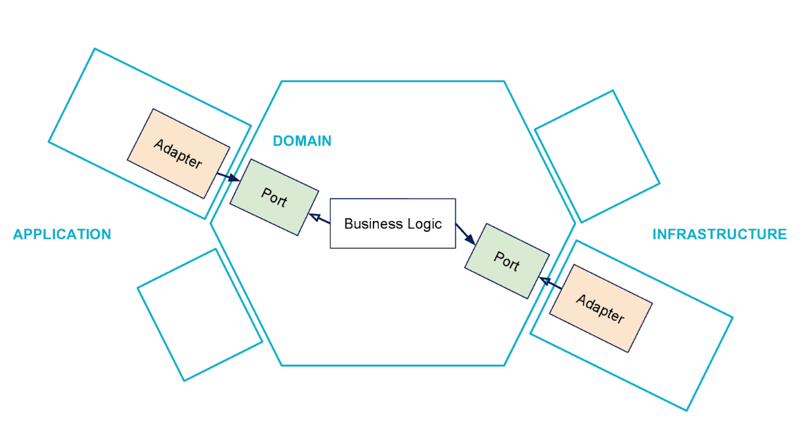
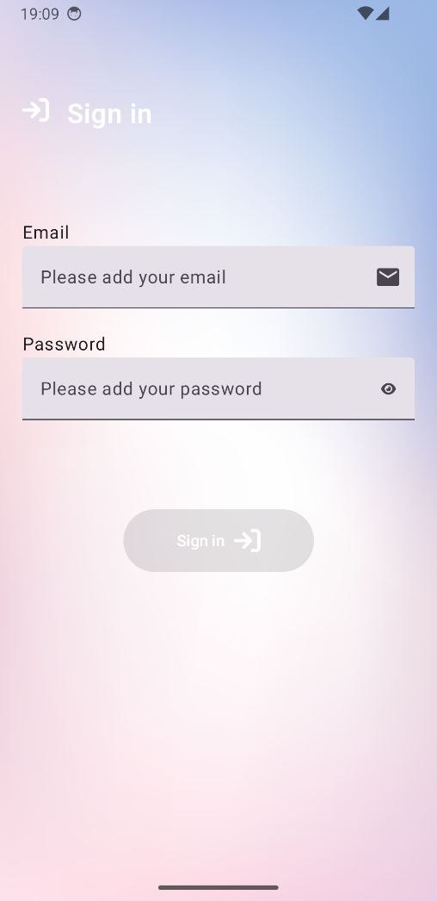
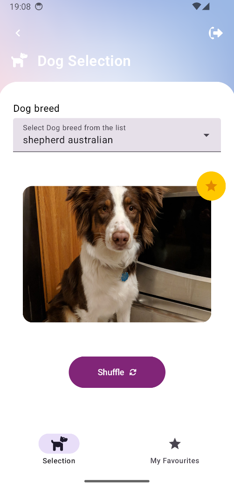
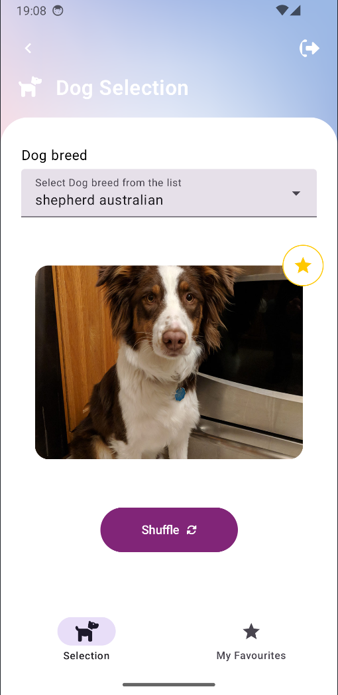
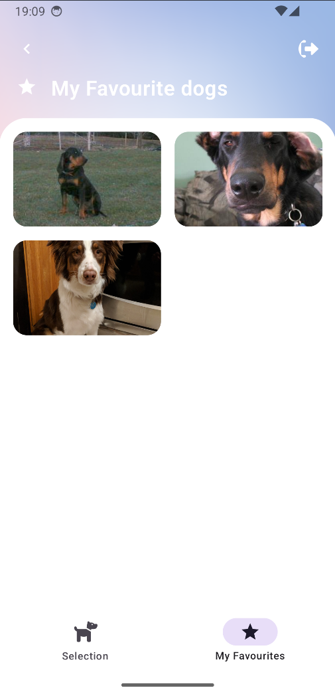

# Dog Lovers App

Android app simulating the DOG API: showing random dog photos of a certain breed
The project is structured with Hexagonal Architecture, MVVM, Jetpack Compose, Retrofit, Multi module and more.

* * *

* ## What has been done:
  * Signin, Signup and Signout using Firebase Authentication
  * Listing all breeds from DOG API.
  * Randomizing dog photos of a selected breed.
  * Allowing the user to save a photo of a dog to his favourites.
  * Listing all favourite dogs from the user.

* ## What are the key concepts of this project:
  * Hexagonal Architecture
  * Jetpack Compose
  * Multi Module project
  * Jetpack Compose Navigation
  * ViewModel
  * Firebase Authentication

* ## What libraries has been used:
  * Retrofit - Interface and client to the API, has a good integration with Kotlin Coroutines
  * OkHttp - To give support to Retrofit
  * Gson - Converts JSON to objects and objects to JSON
  * Jetpack ViewModel - To support reactive states
  * Kotlin Coroutines - To make asynchronous calls
  * Dagger/Hilt - Dependency injection
  * Compose Coil - To load images
  * Mockk - create mocked objects when testing
  * JUnit - Tests
  * Firebase Authentication - Allowing the user to signin, signup, signout
  * Room - Saving favourite dogs to database

* * *
* ## Why Hexagonal Architecture?
  * To create a flow of dependencies pointing to inwards (from Modules to the Domain). So our domain is free from dependencies and we can focus on business logic without worrying about Android technical stuff.
    

* ## Demonstration
*  
*  
*  
*  

* * *
* ## Email
* E-mail: matheusfelipecorreaalves@gmail.com
